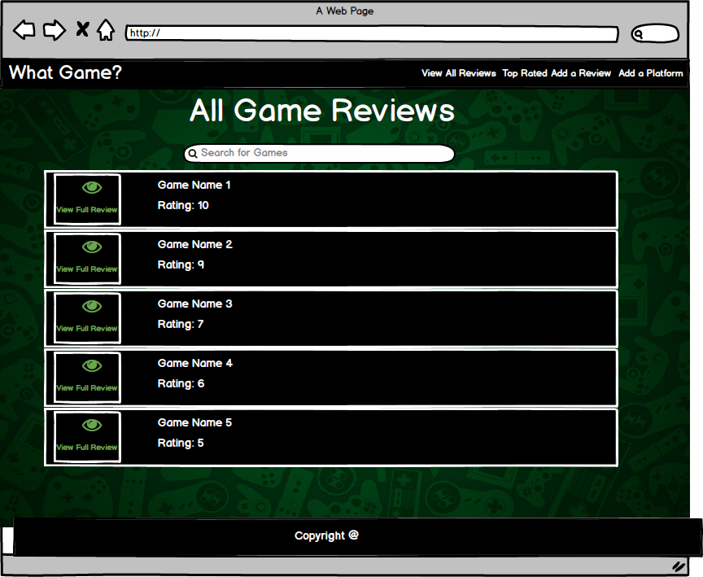
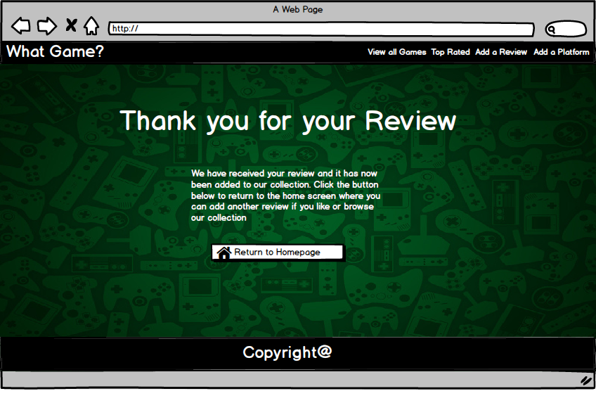
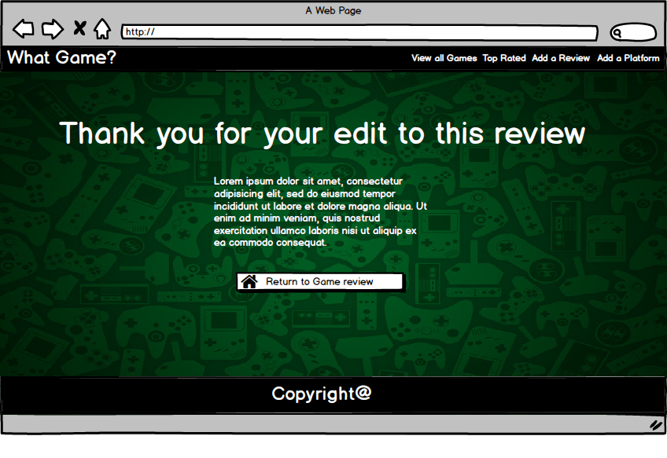
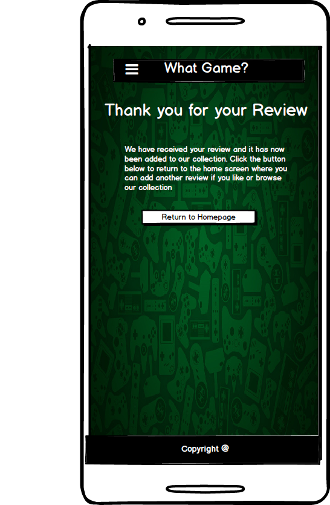
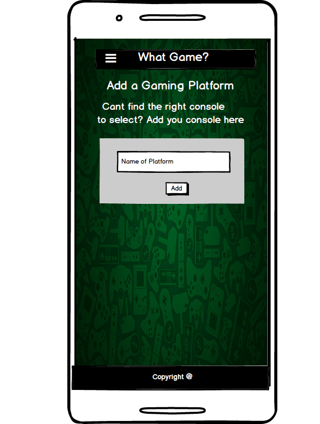
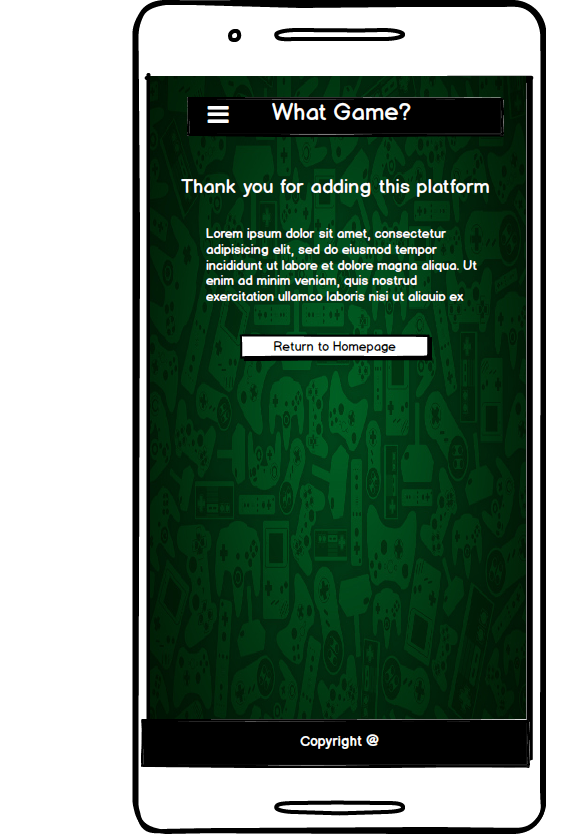
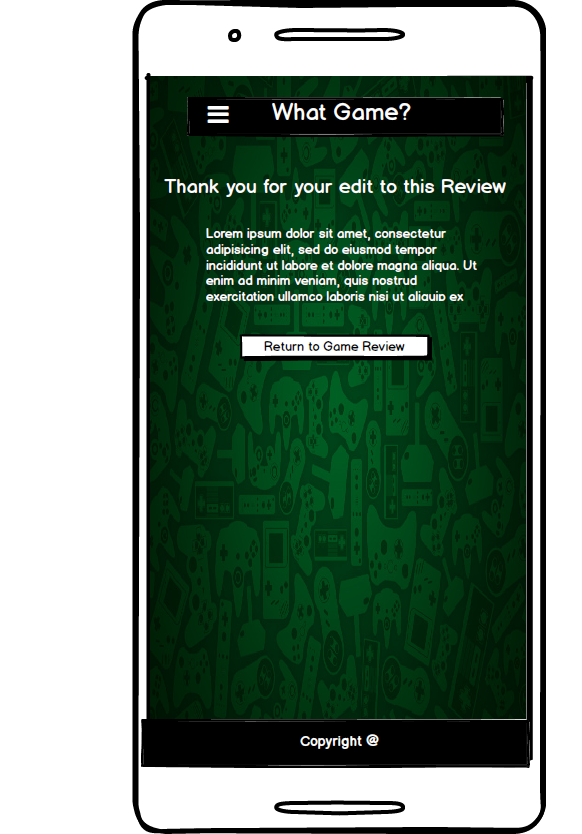

This is a work in progress but the deployed version of the site so far (03/02/20) can be found on Heroku here: https://ms3whatgame.herokuapp.com/

# Overview
For my third milestone project I have chosen to create a videogame review website called WhatGame?.On this website people can view,add,edit and delete videogame reviews. People can also add gaming platforms which get logged to a database which can be used for reviews for future game reviews. There is a 'Top Rated' option in the navigation bar
which, upon clicked, will show the user the ten top most rated games within the site's game reviews collection.
# Website URL
# UX
This website is designed for fans of videogames. It is designed to influence videogame users to choose their next videogame
to play by showing game reviews left by other videogame fans. If a videogame player has an opninion on a particular game which they have played, they can choose to post a review of the videogame on the website. 
## User Stories
As a user I have finished playing my most recent computer game and am interested in finding a new game to play. I can use this website to find suggestions for which games to play and which games to avoid to help me make my next choice of game to 
play.
As a user I have just finished playing a computer game which I thought was very good. I want more people to be aware of how
good the game is in a hope that more people might play it. I can choose to add a review on the site allowing me to give my 
opinions and rating on the game to encourage others to play the game.
As a user I have just finished playing a computer game which I thought wasn't very enjoyable. I want more people to be aware
of how bad an experience I had playing this particular videogame is. I can choose to add a review on the site allowing me to
give my opinions and rating of the game to influence others to avoid the game.
As a user I am leaving a review of a game which I played but I notice that the console which the game is available on isnt
listed in the add review forms choices. I can choose to add the platform to the website so I can select it and allow others
to select it if they are leaving a review of a game which is played using the same console.
As a user I dont have time to read a full review of the videogame I am interested in. I can choose to view a basic rating of
the game on the home or the top rated page without needing to read the full review which will just show me the game name and rating without giving me additional details for the game.
As a user, I only want to find out about the top ten rated games on the website. I can click the 'Top Rated' option in the
navigation bar which will take me to a page which only contains the top ten highest rated games on the website.
As a website owner, I want to create a community where site users can freely post their opinions on different video games.
As a website owner, I want to find out about highly rated games which I am unaware of in the hopes of playing them myself.
# Wireframes
## Desktop
### Home Page

### Top Rated Page

### Add a Review Page

### Review Added Confirmation

### Add a Platform Page

### Platform Added Confirmation

### Edit Review Page

### Edit Review Confirmation

### Game Page

## Mobile
### Home Page

### Top Rated Page

### Add a Review Page

### Review Added Confirmation

### Add a Platform Page

### Platform Added Confirmation

### Edit Review Page

### Edit Review Confirmation

### Game Page

For the background image for all the sites pages, I chose to an image which has a wide variety of different console controllers. I chose this image to emphasize that the site has the possiblity to host game reviews for a large variety of consoles.
The forms on all the pages are coloured grey. I chose this colour scheme as I thought it would stand out well from the background image and allow a user to see a clear seperation between the form they are completing and the background image. The colours found within the form are all white. I chose this colour as I believe it allow the fields to stand out from the form.
For some of the forms input options I chose to create dropdown menus from which the user would have to select a choice. I chose to do these dropdown menus in an attempt to make it easier for the user to choose a value. They also provide a framework which the user has to select a choice within to allow the site to run smoothly when interacting with the game review pages.
The last input area of the form allows a user to paste the URL of an image as a value which is then used as the image on the games review page.
All of the form input areas have icons beside them which are there to add a bit more design to the form.
Each games review page has it's own unique url using the id number given to it via mongo db. I chose to do it this way as I thought it would look better than having all the game reviews on the one page. 
On the desktop version of a game review the games name is the main heading on the page. Below this is a screenshot of the game with some additional information such rating, publisher, release date, genre, platform, local multiplayer information on the game parralel to the image. Below the image and the additional information section is the overview of the game. I chose this layout because I thought it was the best way to lay out each bit of information the site has on the game after a review is left.
For the mobile version of a game review the games name is the main heading on the page. Centred directly below this is a screenshot of the game. Tne additional information section of the game is below the image and the games overview is under the additional information section. I chose this layout because I thought it looked good for a mobile device.
The game review has a background colour that is different to that of the background for the main page. I chose to add a black coloured background with a low opacity etting for this as I thought it looked good and created a clear area for the game reviews contents to sit inside.
When a user leaves a review of a game, they are brought to a page showing a thank you message for leaving the review. There is a button on this page which ,when selected, leads the user back to the homepage where they can then see their review newly listed at the bottom of the game listings.
When a user adds a new platform they are brought to a page showing a thank you message for adding the platform. There is a button on this page which when selected leads the user back to the sites home page. When the user goes to add a review they will see the platform that they added listed in the Platform dropdown section of the form.
When a user edits a review they are brought to a page showing a thank you message for their edit. There is a button on this page which when clicked, leads the user back to the review page for the game they chose to edit the review for which they can then see their changes that they made to the review.
# Features
## Existing Fetures
### Navigation Bar
The Navigation bar has four different options available for a user to choose from- 'View all Games', 'Top Rated', Add a Review' and 'Add a Platform'. 
The View all Games option in the navigation bar is the home page for the site. This will list every game review which the site has on it. 
The Top Rated option in the navigation bar will lead to a page much like the View all Games page. The difference between these two pages is that rather than listing all the reviews for every game on the site the Top Rated page only shows ten of the highest rated games on the website to allow the user to see what is highlt rated very quickly.
The add a review optiion in the navigation bar will lead the user to a form which allows them to fill out fields about a particular game to leave a review for said game.
The add a platform option in the navigation bar will lead the user to a page which they can add a gaming platform to the list of options available for the platform choices in the add a review form. Once this new entry is added via the add platform form, this option will now be availeable to the user to select from the add game review form.
### Short Reviews
In both the View all Games and Top Rated pages each game listing contains a rating for them as well as the game name. This rating is on this page to allow a user to quickly see what the game rating is without having to click into the games page and check there. In each Game listing there is a button for viewing the full review which upon clicking will lead the user to a page which has a review of the game which they clicked the button for. 
## Features Left to Implement
### Search Bar
I plan to add a search bar to the page containing all of the games. This will be to alleviate the need of scrolling down through every game listing to see if there is a desired one there. Instead, a user could just search for the game in the search bar which will then load it's games listing if available or prompt the user that there is no such game review available if its not contained within the sites collection.
### Comments Section
Another feature still left to implement is a comment section to have on each game review page. This will allow users to post comments and reply to comment already left on the page to further increase the interactivity between a user and the site.
### Admin Features
A feature left to implement for this project is Admin only features. These will ensure that only an admin is able to delete a review. As of this moment, any user using the site can freely delete reviews.
### Login
A feature left to implement for this project is allowing users having to log in to edit a review. This is so that when editing a review, the identity of the person changing the review is revealed so as to stop people adding edits that dont relate to the review.
# Technologies Used
* HTML: This project uses HTML to provide the structure of the page.
* CSS:This project uses CSS to provide styling for the HTML.
* Bootstrap: I have used bootstrap in this project to help provide further structure to the page and aid the responsive design aspect of the site.
* Materialize: I have used Materialize in this project for the navigation bar, some font icons and to aid the responsive design aspect of the site.
* FontAwsome: I have made use of FontAwesome to attain some of the icons used for the project.
* Python3: I have used Python a lot for this project.Python is used to redirect users to particular pages when forms are submitted or buttons are clicked making use of views and functions coded with Python. When a form is submitted, I have used Python to allow changes be made to a Mongodb database I have created for the site which contains details on reviews, platforms and ratings. I have linked this mongoDb database to the project using Python. 
I have created local environment variables using python
* Heroku: This project has been deployed to Heroku
# Testing
HTML Validation was done using the validator found at "https://validator.w3.org/". This validation test only returned errors
corresponding to the Jinja 2 statements and expressions. All of the HTML code texted fine.
Python validator found at https://extendsclass.com/python-tester.html

