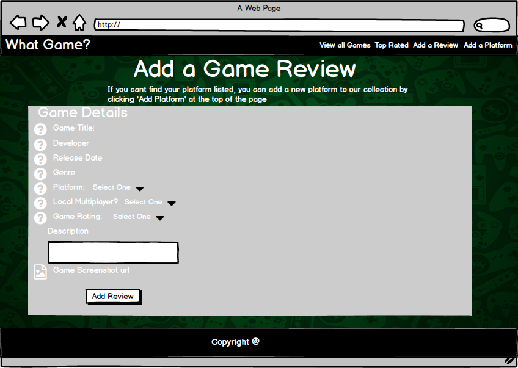
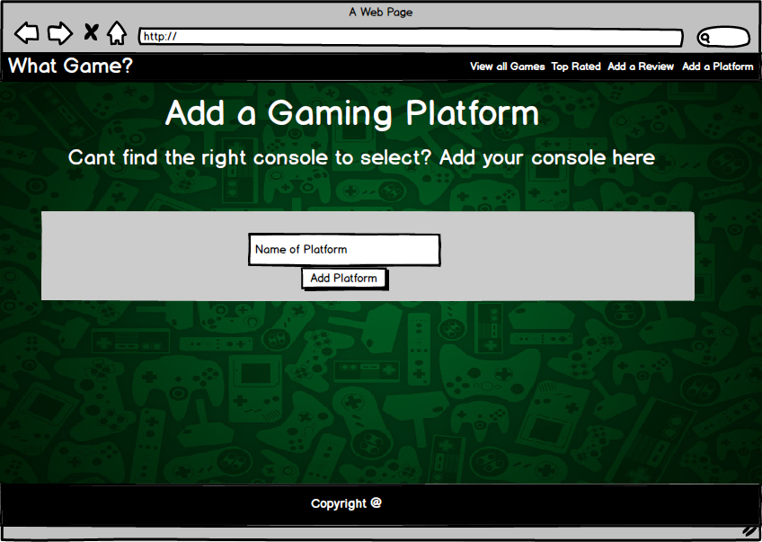
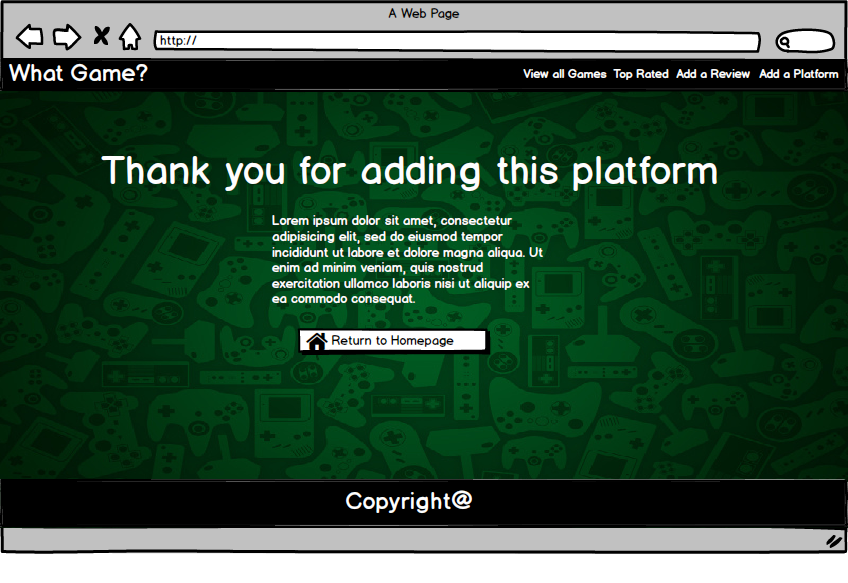
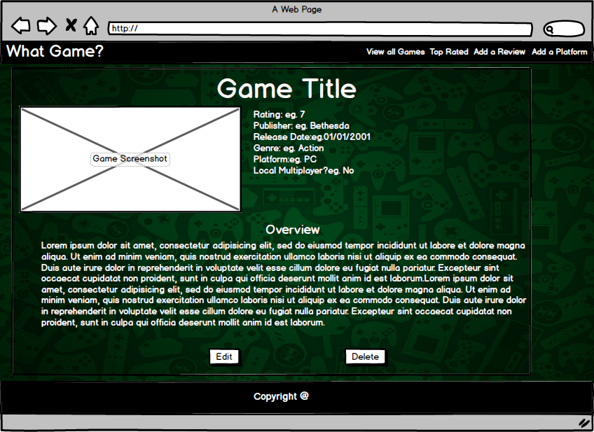
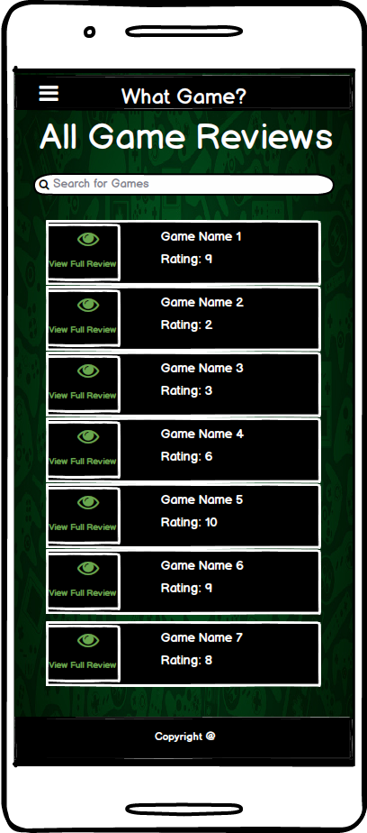
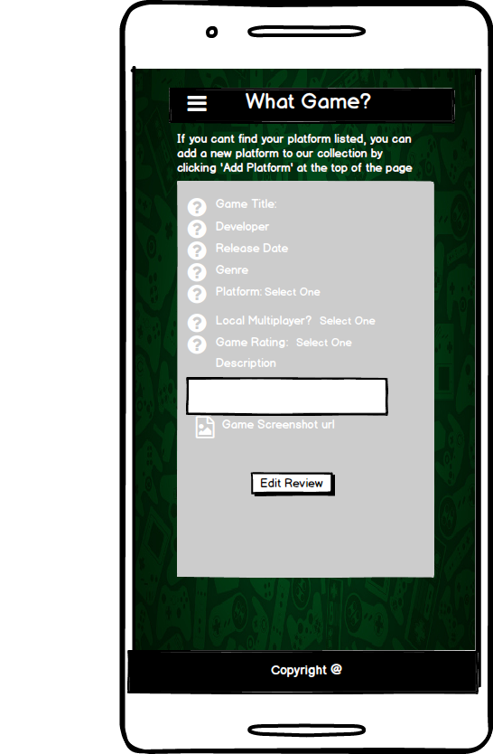
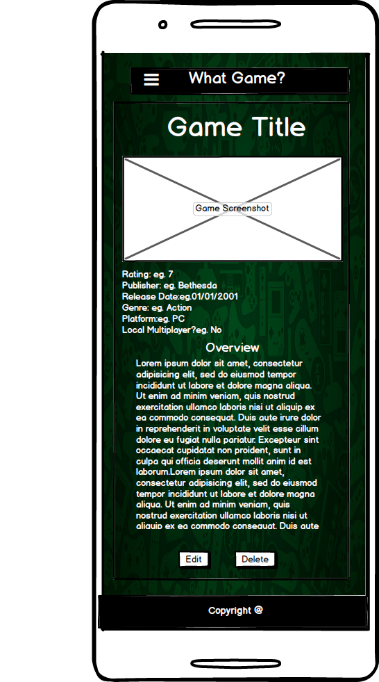

# Overview
For my third milestone project I have chosen to create a video game review website called WhatGame. On this website users can view, add, edit and delete video game reviews. Users can also add gaming platforms which get logged to a database which can then be used for game reviews. There is a 'Top Rated' option in the navigation bar which, upon clicking, will show the user the ten top most rated games within the site's game reviews collection. This site has full CRUD functionality for game reviews. This project has been deployed to Heroku and can be found here: https://ms3whatgame.herokuapp.com/ 
# Website URL
# UX
This website is designed for fans of video games. It is designed to help video game players choose their next video game
to play, or avoid, by showing game reviews left by other video game players. If a video game player has an opinion on a 
particular game which they have played, they can choose to post a review of the video game on the website. 
## User Stories
As a user I have finished playing my most recent computer game and am interested in finding a new game to play. I can use 
this website to find suggestions for which games to play and which games to avoid to help me make my next choice of game to 
play. As a user I have just finished playing a computer game which I thought was very good. I want more people to be aware of how
good the game is in the hope that more people might play it. I can choose to add a review on the site in which I can give my opinions and rating on the game to encourage others to play the game.
As a user I have just finished playing a computer game which I thought wasn't very enjoyable.I can choose to add a review onthe site in which I can give my opinions and rating of the game to help influence others to avoid the game.
As a user I am leaving a review of a game which I played but I notice that the console which I played the game on isn't
listed as an option in the add review form choices. I can choose to add the platform to the website so I can select it and 
allow others to select it if they are leaving a review of a game which is played using the same console.
As a user I don't have time to read a full review of the videogame I am interested in. I can choose to view a basic rating 
of the game without needing to read the full review which will just show me the game name and rating without giving me additional details for the game.
As a user, I only want to find out about the top ten rated games on the website. I can click the 'Top Rated' option in the
navigation bar which will take me to a page which only contains the top ten highest rated games on the website.
As a website owner, I want to create a community where site users can freely post their opinions on different video games.
As a website owner, I want to find out about highly rated games which I am unaware of in the hopes of playing them myself.
# Wireframes
## Desktop
### Home Page

### Top Rated Page

### Add a Review Page

### Review Added Confirmation

### Add a Platform Page

### Platform Added Confirmation

### Edit Review Page

### Edit Review Confirmation

### Game Page

## Mobile
### Home Page

### Top Rated Page

### Add a Review Page

### Review Added Confirmation

### Add a Platform Page

### Platform Added Confirmation

### Edit Review Page

### Edit Review Confirmation

### Game Page

For the background image for all the sites pages, I chose an image which has a wide variety of different console controllers. I chose this image to emphasize that the site has the possibility to host game reviews for a large variety of consoles.
The forms on all the pages are coloured grey. I chose this colour scheme as I thought it would stand out well from the background image and allow a user to see a clear separation between the form they are completing and the background image. The colours found within the form are all white. I chose this colour as I believe it allows the fields to stand out from the form.
For some of the forms input options I chose to create dropdown menus from which the user has to select a choice. I chose to do these dropdown menus in an attempt to make it easier for the user to choose a value. They also provide a framework which the user has to work within to allow the site to run smoothly and create a uniformity when interacting with the game review pages.
The last input area of the form allows a user to paste the URL of an image as a value which is then used as the image on the games review page.
All of the form input areas have icons beside them which are there to add a bit more design to the form.
Each game review page has its own unique url using the id number given to it in mongo db. I chose to do it this way as I thought it would look better than having all the game reviews on the one page. 
On the desktop version of a game review the games name is the main heading on the page. Below this is a screenshot of the game with some additional information such as rating, publisher, release date, genre, platform and local multiplayer information on the game beside the image. Below the image and the additional information section is the overview of the game. I chose this layout because I thought it was the best way to lay out each bit of information the site has on the game after a review is left. The layout on tablets is the same as the desktop layout.
For the mobile version of a game review the games name is the main heading on the page. Centered directly below this is a screenshot of the game. The additional information section of the game is below the image and the games overview is under the additional information section. I chose this layout because I thought it looked good for a mobile device.
The game review,on all devices, has a background colour that is different to that of the background for the main page. I chose to add a black coloured background with a low opacity setting for this as I thought it looked good and created a clear area for the game reviews contents to sit inside.
When a user leaves a review of a game, they are brought to a page showing a thank you message for leaving the review. There is a button on this page which ,when selected, leads the user back to the homepage where they can then see their review newly listed at the bottom of the game listings.
When a user adds a new platform they are brought to a page showing a thank you message for adding the platform. There is a button on this page which when selected leads the user back to the sites home page. When the user goes to add a review they will see the platform that they added listed in the Platform dropdown section of the form.
When a user edits a review they are brought to a page showing a thank you message for their edit. There is a button on this page which when clicked, leads the user back to the review page for the game they chose to edit at which they can then see their changes that they made to the review.
# Features
## Existing Features
### Navigation Bar
The Navigation bar has four different options available for a user to choose from- 'View all Games', 'Top Rated', Add a Review' and 'Add a Platform'. 
The View all Games option in the navigation bar is the home page for the site. This will list every game review which the site has on it. This page also has a search bar which the user can perform a search for a game with.
The Top Rated option in the navigation bar will lead the user to a page much like the View all Games page. The difference between these two pages is that rather than listing all the reviews for every game on the site the Top Rated page only shows ten of the highest rated games on the website to allow the user to see what is highly rated very quickly.
The add a review option in the navigation bar will lead the user to a form which allows them to fill out fields about a particular game to leave a review for the game.
The add a platform option in the navigation bar will lead the user to a page which they can add a gaming platform to the list of options available for the platform choices in the add a review form. Once this new entry is added via the add platform form, this option will now be available to the user to select from the add game review form.
### Short Reviews
In the View all Games,Top Rated and search results pages each game listing contains a rating for them as well as the game name. This rating is on the page to allow a user to quickly see what the game rating is without having to click into the games page and check there. In each Game listing there is a button for viewing the full review which upon clicking will lead the user to a page which has a full review of the game which they clicked the button for. 
### CRUD Functionality
Users can create, read, update and delete videogame reviews.
To create a review the user selects 'Add a Review' from the navigation bar menu. They are then redirected to a form which upon completion will add all of the values they enter into the form to a database hosted on mongoDB.
To read reviews, users can select view all reviews, view the top rated reviews or perform a search for a game. If 'View All Reviews' is selected, the user is redirected to a page which lists every review on the website. If 'Top Rated' is selected, the user is taken to a page which lists the top ten rated games on the site. If the user performs a search and there is a match on the site for the search query the user is taken to a page which lists this search result. For all of these pages, each game has a 'View Full Review' button accompanying the name and rating of each game which upon clicking will take the user to a page showing a full review of the game. Each game's full review has an individual url which makes use of the games id key and value within the database.
Users can update a review by selecting the edit button found on each game review page. This will then lead the user to a form which shows all the current values found within the game review which the user can change. Upon submission of this form, the new details will be shown on the games review page.
Users can delete a review from the site by selecting the delete button found on each game review page. This will then remove the review from the site.
Users can also add new platforms by clicking 'Add a Platform' from the navigation bar menu. They are then redirected to a page containing a form which they can type a platform name into. When this form is submitted, this new platform value is then added to the list of platforms found within the add review form's platform dropdown.  
### Search Bar
There is a search bar on some of the sites pages which allows the user to search the site for a particular game rather than scrolling down the full list of games to find one they are looking for. If there is a match for the game name they type into the search bar, this match is presented to the user on a new page. If there is not a match, the user is presented a page which states that there was no match for the search and prompts the user to try another search.
## Features Left to Implement
### Comments Section
A feature still left to implement is a comment section to have for each game review page. This will allow users to post comments and reply to comments already left on the page to further increase the interactivity between a user and the site.
### Admin Features
A feature left to implement for this project is Admin only features. These will ensure that only an admin is able to delete a review. As of this moment, any user using the site can freely delete reviews.
### Login
A feature left to implement for this project is allowing users to log into accounts on the site which they have created. This would be a good feature because if people leave comments for each game review, somebody looking at the site would be able to see who left the comment. It would also be good for adding and editing reviews because people using the site would then be able to see who added or edited the review.
# Technologies Used
* HTML: This project uses HTML to provide the structure of the page.
* CSS:This project uses CSS to provide styling for the HTML.
* Bootstrap: I have used bootstrap in this project to help provide further structure to the page and aid the responsive design aspect of the site.
* Materialize: I have used Materialize in this project for the navigation bar, some font icons and to aid the responsive design aspect of the site.
* Font Awesome: I have made use of FontAwesome to attain some of the icons used for the project.
* JQuery: I have made use of jQuery in this project. I have used this for the coding of the calendar which is shown when the user selects the release date field from the add review form. I have also used it for the coding of the options available for the platform, multiplayer and rating options found within the add review form to ensure the options stay on screen once the user clicks on the drop down menu.
JQuery is also used to simplify DOM manipulation.
* Jinja: This project makes use of Jinja to allow the database values to be shown in the HTML code.
* Python3: I have used Python a lot for this project.Python is used to redirect users to particular pages when forms are submitted or buttons are clicked making use of views and functions coded with Python. When a form is submitted, I have used Python to allow changes to be made to the Mongodb database I have created for the site which contains details on reviews, platforms and ratings. I have linked this mongoDb database to the project using Python. 
I have created local environment variables using python
* MongoDB. The databases which are used throughout the project are all stored on Mongo.DB
* Heroku: This project has been deployed to Heroku
# Testing
## Code Validation
HTML Validation was done using the validator found at "https://validator.w3.org/". This validation test only returned errors
corresponding to the Jinja 2 statements and expressions. All of the HTML code texted fine.
CSS Validation was done using the validator found at "https://jigsaw.w3.org/css-validator/". This validation test returned no errors.
Python Validation was done using the Python validator found at https://extendsclass.com/python-tester.html
## CRUD Functionality
I tested the CRUD functionality by adding, deleting, updating and deleting reviews on the site. These functions all test fine.
## Page Redirects/Template Rendering
I tested the site to make sure that the user will be directed to the appropriate page when buttons are clicked and forms are submitted. I tested this by following the steps to add and edit reviews and platforms and checking that I was being shown the appropriate pages for each action. 
## Search Bar
I had to test the search bar to make sure that the value the user typed into it was being passed into the backend of the code. I did this with Python. I coded a python function to get the argument that was being passed into the search by assigning it to a variable. I printed this variable to the console to make sure that it was the same value as the value the user entered. This tested fine.
I then had to make sure that the search result returned the correct match which I did by typing a search query which I knew the site had a review for into the search bar and submitting it to see if the review showed on the new page. This tested fine.
I also had to check that when there was no match for the search query, that the page shown was a page stating that there was no match with a prompt for this user to try another search. I did this by typing a game name which I knew the site didn't have a review for into the search bar and submitted the search to make sure I was redirected to the appropriate page. This tested fine.
# Bugs
I encountered a bug which appears when the user is looking at all the games and the top rated bugs. This bug correlates to the positioning of the game name and rating. I had coded for the button part of this list to take up 2 columns and the title and rating to take up 10 columns of this in a row. This code did not work as both these sections were taking up half of the row each. After troubleshooting this I came to the conclusion that this was occurring because I was using both the Materialize and Bootstrap CDN's and the code wasn't working properly because of that. I then commented out the bootstrap cdn code which changed the layout of the list but it didn't seem to change it to the layout which I had hoped it would.
# Deployment
I have been regularly adding and committing changes to the projects local repository and pushing these to Github. I have used Gitpod entirely for coding and have been pushing any additions I make to the local repository onto Github as a precaution in case the changes didn't save in the project workspace so there are no differences between the deployed version and the development version.
I have used Heroku to deploy this site on. The Heroku URL for this project is : https://ms3whatgame.herokuapp.com/
To clone or download the code used to create the site, you can find it on github here:https://github.com/djjtyn/gamereview ,choose the option to either download or clone and follow the instructions on screen. The project requires flask, flask_pymongo, dnspython and gunicorn to run so these will also need to be installed by the code editor in the terminal window.
# Credits
## Media 
The background image I found at https://dribbble.com/shots/3159371-Video-Game-Controller-Background
## Content
A lot of the reviews I have created myself and for the game overview values I chose to copy and paste text from Wikipedia for the game overviews.
## Acknowledgements
* MongoDB- I am using Mongo.DB to host the database for this project on.
* Stack Overflow: I used a lot of information on Stack Overflow to allow me to enhance the site's functionality.

